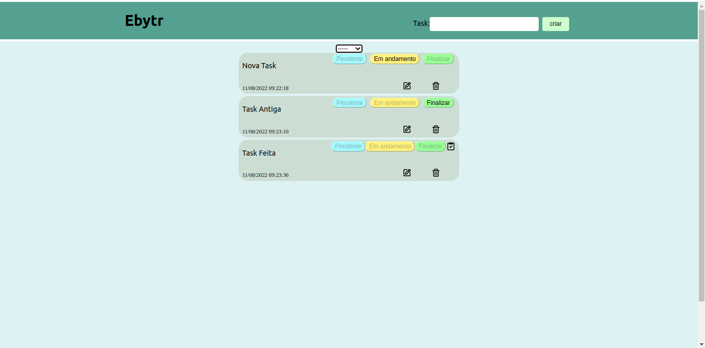

# Ebytr
O Etrybr é um aplicativo de lista de tarefas onde é possivel realizar as ações do CRUD



## Desensolvimento:
### Tecnologias utilizadas no back-end:
Typescript, express, chai, mocha, mongoose

### Tecnologias utilizadas no front-end:
React
# Como executar localmente:
O docker compose utilizado estava na versão 1.29.2 
e o docker na versão 20.10.17
```
git clone git@github.com:MarcosDurval/Ebytr.git
```
### Inicializando o APP

```
cd Ebytr
```
```
docker-compose up --build -d
```
A aplicação podera ser acessada no localhost:3000
### Rode os testes do backend:

```
docker exec -it backend npm run test
```

### Parando a execução
```
docker-compose down --remove-orphans
```
